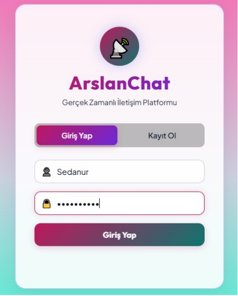
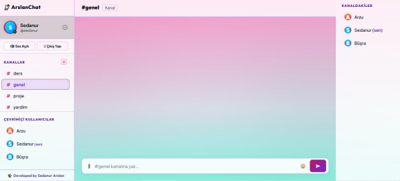
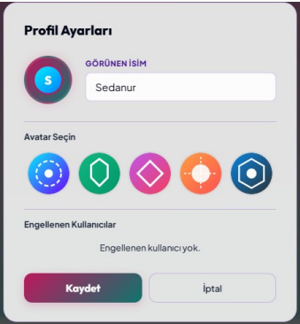
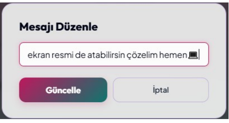

# 📡 ArslanChat – Web Tabanlı IRC / Canlı Yazışma ve Görüntülü Görüşme Sistemi

ArslanChat is a full-stack real-time communication platform that combines IRC-style channels, WebSocket messaging, file sharing, persistent chat history, and browser-to-browser WebRTC audio/video calls.

> **Türkçe özet:** ArslanChat; kanal tabanlı anlık mesajlaşma, dosya paylaşımı, kullanıcı oturumları ve WebRTC ile eşler arası sesli/görüntülü görüşme sağlayan web tabanlı bir iletişim platformudur.

## Screenshots

| Login | Main dashboard |
|---|---|
|  |  |

| Profile settings | Message editing |
|---|---|
|  |  |

> **Türkçe:** Görseller, projenin kayıt/giriş, kanal yönetimi, profil ayarları ve mesaj düzenleme akışlarından alınmış gerçek uygulama ekranlarıdır.

## Highlights

- Channel-based real-time messaging and private messages
- WebRTC audio/video call signaling over WebSockets
- File attachments, dynamic SVG avatars, and message editing
- Session-based authentication with bcrypt password hashing
- NeDB-backed users, channels, and message history

> **Türkçe:** Proje; gerçek zamanlı sohbet, WebRTC görüşme, dosya paylaşımı, kullanıcı oturumu ve kalıcı mesaj geçmişi özelliklerini içerir.

## Proje Özeti

Bu proje, IRC mantığıyla çalışan, WebSocket tabanlı gerçek zamanlı mesajlaşma ve WebRTC teknolojisiyle peer-to-peer görüntülü/sesli görüşme imkânı sunan tam kapsamlı bir web iletişim platformudur.

---

## 🛠 Kullanılan Teknolojiler

| Katman | Teknoloji |
|--------|-----------|
| **Backend** | Node.js + Express.js |
| **Gerçek Zamanlı** | WebSocket (`ws` kütüphanesi) |
| **Görüntülü Görüşme** | WebRTC (tarayıcı API'si) |
| **Veritabanı** | NeDB (dosya tabanlı, MongoDB benzeri) |
| **Şifreleme** | bcryptjs (salt rounds: 12) |
| **Oturum** | express-session |
| **Frontend** | HTML5 + CSS3 + Vanilla JavaScript |

---

## 📁 Proje Yapısı

```
irc-webrtc/
├── index.js              # Ana sunucu başlatma
├── package.json
├── server/
│   ├── db.js             # Veritabanı başlatma & modeller
│   ├── auth.js           # Kayıt/giriş/oturum route'ları
│   ├── api.js            # Kanal & mesaj REST API
│   └── wsHandler.js      # WebSocket + WebRTC signaling
├── public/
│   ├── index.html        # Tek sayfa uygulama (SPA)
│   ├── css/style.css     # Tüm stiller
│   └── js/app.js         # İstemci mantığı (WS + WebRTC)
└── database/             # NeDB dosyaları (otomatik oluşur)
    ├── users.db
    ├── channels.db
    └── messages.db
```

---

## 🚀 Kurulum ve Çalıştırma

### Gereksinimler
- Node.js v16 veya üzeri
- npm

### Adımlar

```bash
# 1. Bağımlılıkları yükle
npm install

# 2. Sunucuyu başlat
node index.js

# 3. Tarayıcıda aç
# http://localhost:3000
```

---

## 🗄 Veritabanı Şeması

### users koleksiyonu
```json
{
  "_id": "auto",
  "username": "string (lowercase, unique)",
  "displayName": "string",
  "password": "bcrypt hash",
  "createdAt": "Date",
  "online": "boolean"
}
```

### channels koleksiyonu
```json
{
  "_id": "auto",
  "name": "string (unique)",
  "topic": "string",
  "createdBy": "string",
  "createdAt": "Date"
}
```

### messages koleksiyonu
```json
{
  "_id": "auto",
  "channel": "string (#kanal veya dm:user1:user2)",
  "sender": "string",
  "senderDisplay": "string",
  "text": "string",
  "createdAt": "Date",
  "isDM": "boolean (opsiyonel)"
}
```

---

## 🔄 WebRTC Bağlantı Akışı

```
Arayan (A)                 Signaling (Server)              Aranan (B)
   |                              |                             |
   |──── callInvite ─────────────>|──── callInvite ────────────>|
   |                              |                             |
   |                              |<─── callAccept ─────────────|
   |<─── callAccept ──────────────|                             |
   |                              |                             |
   |── getUserMedia() ────────────────────────── getUserMedia() ─|
   |── createOffer() ──────────────────────────────────────────  |
   |──── sdpOffer ────────────────>|──── sdpOffer ──────────────>|
   |                              |                   createAnswer()
   |                              |<─── sdpAnswer ──────────────|
   |<─── sdpAnswer ───────────────|                             |
   |                              |                             |
   |──── iceCandidate ────────────>|──── iceCandidate ──────────>|
   |<─── iceCandidate ────────────|<──── iceCandidate ──────────|
   |                              |                             |
   |═══════════════ P2P Video/Audio Bağlantısı ═════════════════|
```

---

## 🔒 Güvenlik Önlemleri

1. **Şifre Hashing**: bcryptjs ile 12 salt round (endüstri standardı)
2. **Oturum Yönetimi**: express-session ile sunucu taraflı oturumlar
3. **XSS Koruması**: Tüm kullanıcı girdileri `escHtml()` ile temizlenir
4. **Input Validasyon**: Kullanıcı adı ve kanal adları regex ile kontrol edilir
5. **Yetkisiz WS Bağlantısı**: Oturumu olmayan WebSocket bağlantıları reddedilir

---

## ✅ Teslim Kriterleri Karşılama Durumu

| Kriter | Durum |
|--------|-------|
| Kullanıcı kayıt/giriş | ✅ |
| Sohbet odaları (#genel, #ders, #yardim, #proje) | ✅ |
| Yeni oda oluşturma | ✅ |
| Gerçek zamanlı mesajlaşma | ✅ WebSocket |
| Özel mesaj (DM) | ✅ |
| Çevrimiçi kullanıcı listesi | ✅ |
| WebRTC görüntülü görüşme | ✅ |
| Görüşme daveti / kabul / ret | ✅ |
| Signaling sunucusu (SDP + ICE) | ✅ |
| Mesajlar veritabanında | ✅ NeDB |
| Kamera/mikrofon kapatma | ✅ |
| Mesaj geçmişi | ✅ Son 80 mesaj |

---

## 📦 Açık Kaynak Kütüphaneler

| Kütüphane | Sürüm | Amaç |
|-----------|-------|------|
| express | ^5.x | HTTP sunucu |
| ws | ^8.x | WebSocket sunucu |
| express-session | ^1.x | Oturum yönetimi |
| bcryptjs | ^2.x | Şifre hashleme |
| uuid | ^9.x | Benzersiz ID üretimi |
| nedb-promises | ^6.x | Dosya tabanlı veritabanı |
